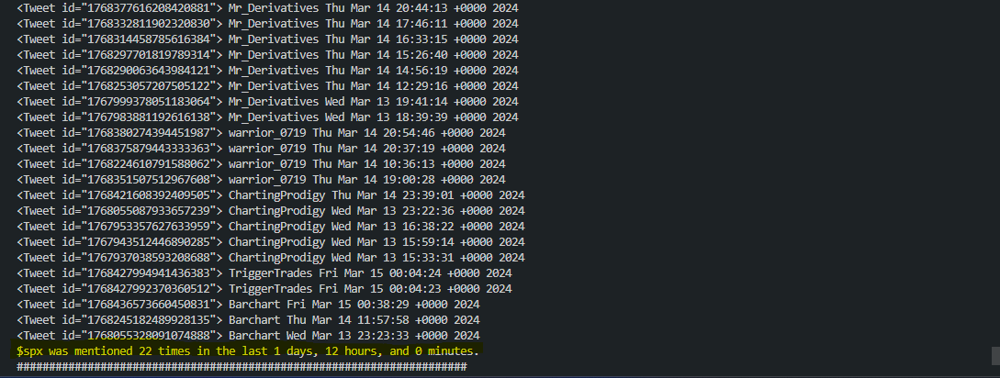

# Stock Twitter Scraper

## Overview
Stock Twitter Scraper is a Python script that allows you to scrape Twitter for mentions of a specific stock ticker (or any other word for that matter)
within a specified time interval. 

## Features
- Scrape Twitter for mentions of specific stock tickers.
- Specify a time interval to search for tweets within.
- Retrieve data from multiple Twitter accounts simultaneously.

## Installation
1. **Clone the repository:**
    ```bash
    git clone https://github.com/your-username/stock-twitter-scraper.git
    ```

2. **Install dependencies:**
    ```bash
    pip install -r requirements.txt
    ```

3. **Set up environment variables:**
   - Rename the `.env-example` file to ".env" in the root directory.
   - Fill the following variables in the `.env` file:
     ```plaintext
     TWITTER_USERNAME=your_twitter_username
     TWITTER_EMAIL=your_twitter_email
     TWITTER_PASSWORD=your_twitter_password
     ```

## Usage
1. **Modify the script `app.py` with your desired parameters:**
   - `twitter_accounts_list`: List of Twitter accounts to scrape.
   - `stock_ticker`: The stock ticker to search for.
   - `time_interval`: The time interval to search within (in days, hours, and minutes) in the form of a list [days, hours, minutes].

2. **Navigate to the project directory and run the script:**
    ```bash
    python app.py
    ```

3. **The script will continuously scrape Twitter for mentions of the specified stock ticker within the given time interval until you
    max out your tweets-viewing limit or exit the script.**


## Quick Example

### Call the function stock_scrapper with your desired parameters:
```python
stock_scrapper(["Mr_Derivatives", "warrior_0719", "ChartingProdigy", "allstarcharts",
"yuriymatso", "TriggerTrades", "AdamMancini4", "CordovaTrades", "Barchart", "RoyLMattox"],
 "$spx", [1, 12, 0])
```
### Example Output

